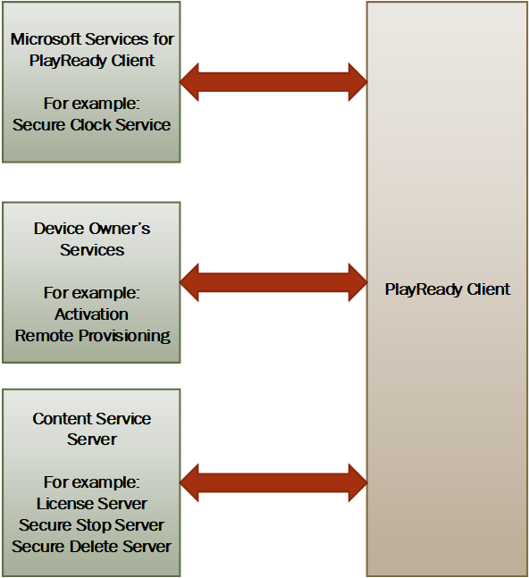

---
author:
title: "PlayReady Communication Protocols"
description: ""
ms.assetid: "27BE5F0E-C171-4091-BACE-A029C6FE53B5"
kindex: SOAP, PlayReady protocols
kindex: protocols, PlayReady communication
kindex: communication, PlayReady SOAP
keywords:
ms.author:
ms.topic: conceptual
ms.prod: playready
ms.technology: drm
---

# PlayReady Communication Protocols

PlayReady clients communicate with PlayReady servers to acquire licenses and perform additional operations related to the management of rights set by services for clients. Clients also communicate with other services that allow them to function according to the [PlayReady Compliance and Robustness Rules](https://www.microsoft.com/playready/licensing/compliance/) (for example, to a secure clock service, which provides the trusted time and allows the client to enforce time restrictions).

## PlayReady Server&mdash;PlayReady Client Communication

Most communication between a PlayReady client and a PlayReady server are managed through the use of Simple Object Access Protocol (SOAP) messages. This communication begins when the client sends a SOAP message containing a challenge. The server responds with a SOAP message that contains a response. Both the challenge and the response contain information in XML format that signifies the type of challenge or response, and the various elements needed to process and identify the specific transaction that needs to take place.

Examples of the challenge and response SOAP messages can also be found on a PlayReady server after installing and configuring IIS for PlayReady. 

## Microsoft Services for PlayReady Clients

Microsoft operates a service to which a PlayReady client can connect to acquire the current time and set their secure clocks. The following table lists information about the existing versions of the secure clock services provided by Microsoft. The Porting Kit column describes which porting kits support each of the secure clock service versions.

<table>
<tr> <th>

Version</th> <th>

Name&mdash;Links</th> <th>

Porting Kit</th> </tr>

<tr> <td>1</td> <td> Secure Clock V1  (nicknamed Secure Clock Legacy)  Set up in 2002, on Microsoft premises   &nbsp;&nbsp;http://go.microsoft.com/fwlink/?LinkID=25812 &nbsp;&nbsp;http://go.microsoft.com/fwlink/?LinkID=25817 &nbsp;&nbsp;http://go.microsoft.com/fwlink/?LinkID=88262 forwards to: &nbsp;&nbsp;https://services.wmdrm.windowsmedia.com/SecureClock/?petition  </td> <td> All WMDRM 7 (2002)  All WMDRM 10.08 (2006)  All PR PK 1.0 (2008)  All PR PK 1.2 (2008)  Some PR PK 2.0 (2011)  Some PR PK 2.5 (2013) </td> </tr>

<tr> <td>2</td> <td> SecureClock V2  (nicknamed Secure Clock VISTA)  Set up in 2010, on Microsoft premises &nbsp;&nbsp;http://go.microsoft.com/fwlink/?LinkID=130559 &nbsp;&nbsp;http://go.microsoft.com/fwlink/?LinkID=149408   forwards to: &nbsp;&nbsp;https://services.wmdrm.windowsmedia.com/SecureClock/VISTA_RTM/?Petition  </td> <td> Some PR PK 2.0 (2011)  Some PR PK 2.5 (2013)  All PR PK 2.11 (2014)  All PR PK 3.0 (2015)  (REE Only) </td></tr>

<tr> <td>3</td> <td> Secure Clock V3  Set up in 2016, in Microsoft Azure &nbsp;&nbsp;http://go.microsoft.com/fwlink/?LinkID=799153   forwards to: &nbsp;&nbsp;https://secureclock2.playready.microsoft.com/secureclock/vista_rtm/?petition  </td> <td>Compatible with all PR PK 1.0 to 3.0 included </td>  </tr>

<tr> <td>4</td> <td> Secure Clock V4  (nicknamed Secure Time)  Set up in 2016 in Microsoft Azure &nbsp;&nbsp;http://go.microsoft.com/fwlink/?LinkID=746259 &nbsp;&nbsp;https://go.microsoft.com/fwlink/?LinkID=746341   forwards to: &nbsp;&nbsp;http://securetime.playready.microsoft.com/SecureTime &nbsp;&nbsp;https://securetime.playready.microsoft.com/SecureTime  </td> <td> All PR PK 3.2+ (2016)  (REE or TEE) </td>  </tr>
 </table>

## Client Owner Services

Final Product Licensees may design their device or application so as to contact a service when they perform PlayReady operations. A very common scenario is the remote provisioning service, which delivers a unique device certificate to a client the first time it performs a PlayReady operation.

These services are specific to the client owner, and use ad-hoc protocols.

Microsoft operates some of these services for the clients that it develops, for example Windows 10 PlayReady, Windows 8.1 PlayReady, Xbox PlayReady, Silverlight, and so on.