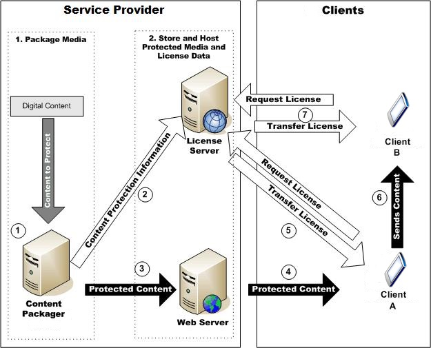

# Scenario: Super Distribution
   
  
In the super-distribution scenario, protected content is acquired and downloaded with a persistent license by one user on one client (user A, client A). Another user on another client (user B, client B), copies the content from client A to client B. User B tries to play the content, but can't until it has acquired a license for client B. Client B issues a license request to the service for the content. The service has the option to decline the request, or to deliver a license against some form of payment. User A, which contributed to "super"-distribute the content from the service to additional users, may be rewarded by the service by a back margin on the price paid by user B, or by any other form of renumeration (rewards points, bonuses, and so on).   
   
  
    
   
  
The super-distribution scenario performs the following steps, as illustrated in the figure:   
 
   1. The service provider transfers unprotected content to the content packaging server, where it is protected. 
  
   1. The service provider transfers content protection information to a license server. 
  
   1. The service provider transfers protected content to a Web server. 
  
   1. The service provider sends protected content to client A. When client A attempts to play back the content, the content header indicates that the content is protected. 
 
   1. Client A then must acquire a license. Once client A has a license, it can play back or preview the content that was distributed. 
  
   1. Client A transfers the content to client B. 
  
   1. When client B attempts to play back the content, the content header indicates that the content is protected. 
  
   1. Client B then must acquire a license. Once client B has a license, it can play back or preview the content that was super-distributed. Note that preview is enforced by having a different policy than permanent or subscription licenses; for example, a license with a play-once policy could be used for preview.   

 
  
